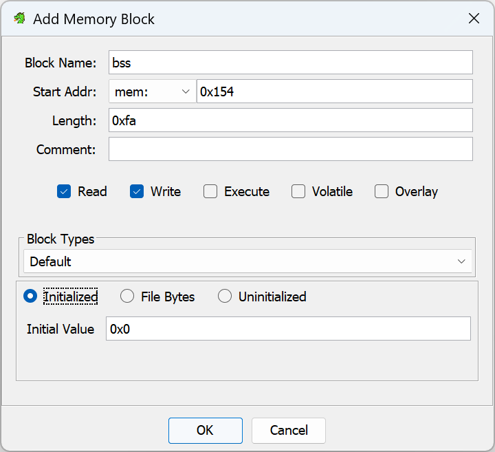

+++
title = "The State of Reverse Engineering Arduino Binaries with Ghidra"
date = 2024-04-07
publishdate = 2024-04-08
keywords = ["arduino", "ghidra", "reverse engineering", "atmega328p"]
draft = false
+++

Literature about reverse engineering Arduino binaries using
[Ghidra](https://ghidra-sre.org/) appears to be sparse. Therefore, with this
post, I want to give a short introduction to the architecture and provide a
starting point for analysis. However, since Ghidra only rudimentary supports the
ATmega328P (used by the Arduino Uno), the post will also outline the state of
the current (April 2024) support for this architecture and demonstrate its
limits. 

<!--more-->

_Disclaimer: At daytime, I work in offensive IT security, which requires some
level of reverse engineering, however mostly of high-level binaries (Linux and
Windows). I also have some experience with microcontrollers, but I am by no means
a well-versed embedded systems (reverse) engineer._

## Test Setup

I will be working with the [Arduino Uno Rev
3](https://store.arduino.cc/products/arduino-uno-rev3). Maybe in the future I'll
focus on other Arduino models and Arduino-like platforms, for example the
Arduino Micro or the ESP8266, but for now this must suffice.

Also, I will be using the example project
["ASCIITable"](https://docs.arduino.cc/built-in-examples/communication/ASCIITable/)
that is shipped with the Arduino IDE. You can find its source code [on
GitHub](https://github.com/arduino/arduino-examples/blob/5d991a2ce69d22e8b21a1ee89ec715f093d45276/examples/04.Communication/ASCIITable/ASCIITable.ino)
if you want to ~~follow along~~ cheat, but for now, let's pretend that we lost
the source code.

## Dumping the Flash

The binary can be dumped from the Arduino's flash with the tool `avrdude` that
is shipped with the Arduino SDK[^1]:

[^1]: Note that this dumps the entire flash, even if the program only occupies a
    fraction of it. The remaining image might also contain data from previous
    uses, unrelated to the current program.

```shell
avrdude "-C/etc/avrdude.conf" -v -V -patmega328p -carduino -P/dev/ttyUSB1 -b115200 -D "-Uflash:r:blogpost.bin:r"
```

If you would like to reproduce this, you might need to change `/dev/ttyUSB1` for
the serial port that the Arduino is registered at, which you can list using `ls
/dev/ttyUSB*`. The same also works on Windows, where the serial port is called
something like `COM1`.

The invocation generates the file `blogpost.bin` which contains the flash
contents as raw binary. If you obtained the flash contents in [Intel HEX
format](https://en.wikipedia.org/wiki/Intel_HEX) (which is a bit more common),
you could convert this file to raw binary using the following command[^2]:

```shell
objcopy --input-target=ihex --output-target=binary blogpost.hex blogpost.bin
```

[^2]: Ghidra in theory also supports Intel HEX files, but I experienced problems
    mapping additional memory sections to the HEX file.

## Ghidra Preparation

At the heart of the Arduino Uno is the AVR (formerly _Atmel_) ATmega328P 8-bit
microcontroller
([datasheet](https://ww1.microchip.com/downloads/en/DeviceDoc/Atmel-7810-Automotive-Microcontrollers-ATmega328P_Datasheet.pdf)).

 
"8 bit" in this context means that operations usually operate on 8-bit values (0
to 255, or -127 to 128) and registers therefore are also 8 bit in size. However,
instructions are either 16 or 32 bit wide and therefore addressing is done in
16-bit blocks. Therefore, registers are often used in pairs.


Unfortunately, Ghidra does not directly support this microcontroller. The good
news is, though, that it supports similar AVR 8-bit microcontrollers and someone
already wrote some helper files for the ATmega328 (shoutout to GitHub user
[@ahroach](https://github.com/ahroach)).

First, we need to place the file
[github.com/ahroach/avr_ghidra_helpers/atmega328.pspec](https://github.com/ahroach/avr_ghidra_helpers/blob/a98c18b2ec627a6a2e16df360f98ce59a00eb187/atmega328.pspec)
in the directory `Ghidra/Processors/Atmel/data/languages`. Then, we modify the
file `Ghidra/Processors/Atmel/data/languages/avr8.ldefs` and add the
`<language>` tag highlighted in the following listing:


```xml {hl_lines=["6-20"]}
<?xml version="1.0" encoding="UTF-8"?>

<language_definitions>
<!-- [...] -->

  <language processor="AVR8"
            endian="little"
            size="16"
            variant="atmega328"
            version="1.0"
            slafile="avr8eind.sla"
            processorspec="atmega328.pspec"
            manualindexfile="../manuals/AVR8.idx"
            id="avr8:LE:16:atmega328">
    <description>AVR8 for an Atmega 328</description>
    <compiler name="gcc"        spec="avr8egcc.cspec"        id="gcc"/>
    <external_name tool="gnu" name="avr:51"/>
    <external_name tool="gnu" name="avr:6"/>
    <external_name tool="IDA-PRO" name="avr"/>
  </language>

<!-- [...] -->
</language_definitions>
```

Restart Ghidra and you should be able to improt files for the `atmega328`
architecture configuration.

## Analysis in Ghidra

Although the following sections certainly assume that you have some basic Ghidra
knowledge, I will walk you through the initial analysis:

 1. After starting Ghidra, create a new project using _File_ > _New Project_
 2. Select "Non-Shared Project"
 3. Choose a parent "Project Directory" (Warning: this directory will be cluttered with a few files) and a project name
 4. Import the dumped `.bin` file, either via drag-and-drop or by choosing _File_ > _Import File_ from the menu.
 5. Click on "..." next to "Language" and select "AVR8 / atmega328 / 16 / little / gcc":
 
 6. Confirm all dialogs with _OK_
 7. Double-click the imported file to open it in Ghidra's CodeBrowser
 8. Ghidra will ask whether to analyze - keep the default options and click _Analyze_

You should now see the program's memory in Ghidra's CodeBrowser.

### Interrupt Vector Table

A good starting point for understanding the program is the [Interrupt Vector
Table](https://en.wikipedia.org/wiki/Interrupt_vector_table). This table is
usually located at the address `0x00000000` and contains `jmp` instructions
(so-called _interrupt handlers_) that the processor calls when an interrupt
occurs, i.e. "something important happens". The table from the
[ATmega258P
datasheet](https://ww1.microchip.com/downloads/en/DeviceDoc/Atmel-7810-Automotive-Microcontrollers-ATmega328P_Datasheet.pdf)
lists the expected entries.

<details>
  <summary>Show Interrupt Vector Table</summary>

  |Program Address|Source|Interrupt Definition|
  |-|-|-|
  |0x0000|RESET| External pin, power-on reset, brown-out reset and watchdog system reset |
  |0x002|INT0| External interrupt request 0 |
  |0x0004|INT1| External interrupt request 1 |
  |0x0006|PCINT0| Pin change interrupt request 0 |
  |0x0008|PCINT1| Pin change interrupt request 1 |
  |0x000A|PCINT2| Pin change interrupt request 2 |
  |0x000C|WDT| Watchdog time-out interrupt |
  |0x000E|TIMER2| COMPA Timer/Counter2 compare match A |
  |0x0010|TIMER2| COMPB Timer/Counter2 compare match B |
  |0x0012|TIMER2| OVF Timer/Counter2 overflow |
  |0x0014|TIMER1| CAPT Timer/Counter1 capture event |
  |0x0016|TIMER1| COMPA Timer/Counter1 compare match A |
  |0x0018|TIMER1| COMPB Timer/Counter1 compare match B |
  |0x001A|TIMER1| OVF Timer/Counter1 overflow |
  |0x001C|TIMER0| COMPA Timer/Counter0 compare match A |
  |0x001E|TIMER0| COMPB Timer/Counter0 compare match B |
  |0x0020|TIMER0| OVF Timer/Counter0 overflow |
  |0x0022|SPI, STC| SPI serial transfer complete |
  |0x0024|USART, RX| USART Rx complete |
  |0x0026|USART, UDRE| USART, data register empty |
  |0x0028|USART, TX| USART, Tx complete |
  |0x002A|ADC| ADC conversion complete |
  |0x002C|EE READY|  EEPROM ready |
  |0x002E|ANALOG| COMP Analog comparator |
  |0x0030|TWI| 2-wire serial interface |
  |0x0032|SPM READY|  Store program memory ready |

</details>

And indeed, we can find this table in the disassembly:


### The RESET Interrupt Handler

Let's now inspect the `RESET` interrupt handler, `FUN_code_000035`:


Before actually doing something interesting, this function initializes the program's memory, just like an ELF/PE loader would do:

```cpp {hl_lines=["7-14","16-21","23-30"]}
void FUN_code_000035(void)

{
  // [...]
  R1 = 0;

  X = &DAT_mem_0100;
  Z = 0x74e;
  while (puVar1 = X, (byte)X != 0x54 || X._1_1_ != (char)(R17 + ((byte)X < 0x54))) {
    R0 = *(undefined *)(uint3)Z;
    Z = Z + 1;
    X = X + 1;
    *puVar1 = R0;
  }
  
  R18 = 1;
  X = &DAT_mem_0154;
  while (puVar1 = X, (byte)X != 0xfa || X._1_1_ != (char)(R18 + ((byte)X < 0xfa))) {
    X = X + 1;
    *puVar1 = R1;
  }

  R17 = 0;
  Y = 0x35;
  while ((byte)Y != 0x34 || (bool)Y._1_1_ != (byte)Y < 0x34) {
    Y = Y - 1;
    Z = Y;
    _DAT_mem_08fd = 0x56;
    FUN_code_00039f();
  }

  // [...]
}
```

The first highlighted block copies `0x54` bytes from the raw file offset `0x7e4`
to the memory block starting at `0x0100`. This procedure is called
`__do_copy_data`, as it loads a `.data` section. The corresponding (assembler)
code can be found [in GCC's source
code](https://github.com/gcc-mirror/gcc/blob/4e3c8257304c55f2ebfb24bd6de3236bda0f054e/libgcc/config/avr/lib1funcs.S#L2367).

The second block erases `0xfa` bytes in memory, starting from the offset
`0x154`, directly after the data segment. This is called `__do_clear_bss` and is
also added  [by
GCC](https://github.com/gcc-mirror/gcc/blob/4e3c8257304c55f2ebfb24bd6de3236bda0f054e/libgcc/config/avr/lib1funcs.S#L2436).
The `.bss` section contains initial values for static variables.

The third block is a bit more complicated, but can be ignored for now. It is
called `__do_global_ctors` and calls global constructors.

Note that not all `RESET` interrupt handlers will contain all three of these
blocks. GCC will add them if necessary, and thus some simple programs without
global state will not have them. 

In any case, we can use the offsets and lengths to further refine the memory
map: Open the _Memory Map_ window through the _Window_ menu. Delete the
auto-generated `mem` section. Then, add two sections, one `data` and one `bss`
as shown in the following two screenshots. Make sure to fill in the offsets and
lengths determined in the step above:




Eventually, your memory map should look like this:


Note that I configured the `data` section as read-only because it yielded better
results in my case. I don't know if GCC will ever put any variable data in that
area.

You may need to rerun the analysis in order for Ghidra to pick up on data
structures in the `data` section (menu _Analysis_ > _Auto Analyze
'blogpost.bin'..._).


Because I name all labels and functions that I've figured out during analysis,
you may see labels such as `__do_copy_data` in subsequent screenshots and
listings.


### Main Function

There are two remaining functions called in the `RESET` interrupt handler, in my case `FUN_code_00025f` and `FUN_code_0003a5`.
The latter is a simple infinite empty loop, which GCC calls `exit`:

```cpp
void exit(void)
{
  do {
                    /* WARNING: Do nothing block with infinite loop */
  } while( true );
}
```

The first function is the `main` function. However, as you might know, the
Arduino IDE does not let you write a `main` function yourself, but instead
requires you write the `setup` and `loop` callbacks. These are called directly
by the `main` function, which can be found in the file
[`cores/arduino/main.cpp`](https://github.com/arduino/ArduinoCore-avr/blob/63092126a406402022f943ac048fa195ed7e944b/cores/arduino/main.cpp#L33,L51):

```cpp {hl_lines=["6","8"]}
int main(void)
{
  init();
  initVariant();
 
  setup();
  for (;;) {
    loop();
    if (serialEventRun) serialEventRun();
  }
        
  return 0;
}
```

In our case, GCC appears to have inlined `init`, `initVariant`, `setup` and `loop`.
Therefore, the `main` function starts with a quite repetitive initializer code:

```cpp {hl_lines=["5-18"]}
void main(void)
{
  byte bVar1;
  
  R25R24._0_1_ = TCCR0A;
  R25R24._0_1_ = (byte)R25R24 | 2;
  TCCR0A = (byte)R25R24;
  R25R24._0_1_ = TCCR0A;
  R25R24._0_1_ = (byte)R25R24 | 1;
  TCCR0A = (byte)R25R24;
  R25R24._0_1_ = TCCR0B;
  R25R24._0_1_ = (byte)R25R24 | 2;
  TCCR0B = (byte)R25R24;
  R25R24._0_1_ = TCCR0B;
  R25R24._0_1_ = (byte)R25R24 | 1;
  TCCR0B = (byte)R25R24;
  R25R24._0_1_ = TIMSK0;
  R25R24._0_1_ = (byte)R25R24 | 1;

  // [...]
}
```

These lines set up the timer prescaler values, according to [the `init` function
in
`wiring.c`](https://github.com/arduino/ArduinoCore-avr/blob/63092126a406402022f943ac048fa195ed7e944b/cores/arduino/wiring.c#L241,L392)
(here inlined). They are easily recognizable and thus can also be used to find
`init` or `main`.

Usually, you will also be able to recognize the huge `while (true) { [...] }`
loop that repeatedly calls the user-defined `loop` callback (or its inlined
instructions).

### Discover Strings

In my experience, Ghidra is worse in detecting strings than binutils' `strings`
command. Therefore, I wrote [a
script](https://github.com/jojonas/ghidra_scripts/blob/main/Strings.java) that
applies the same logic to Ghidra memory spaces. Compare the before and after:


### AVR Calling Convention

As someone used to the various x86 and x64 calling conventions (like me), the
[description of the calling convention used by
GCC-AVR](https://gcc.gnu.org/wiki/avr-gcc#Calling_Convention) appears rather unfamiliar.
To sum it up:
 * Single-byte parameters such as `char` and `uint8_t` are passed in single
   registers, starting register `R24`, followed by `R22`, `R20`, and so on.
 * Two-byte parameters such as `int` and pointers (e.g. `char*`) are passed in
   register pairs, starting with `R25R24`, `R23R22`, `R21R20`, and so on.
 * A similar algorithm is used for larger arguments. These series continue down to
   `R8`, other arguments are passed in memory.
 * Return values are passed in registers, again starting with `R24` for
   single-byte values, `R25R24` for two-byte values and so on.

With this knowledge we can now understand an invocation like this:

```asm
ldi        R24 ,0x14
ldi        R25 ,0x1
call       FUN_code_00016c
ldi        R24 ,0x30
ldi        R25 ,0x1
call       FUN_code_00016c
```

These lines appear to correspond to invocations such as:

```c
FUN_code_00016c((void*)0x114);
FUN_code_00016c((void*)0x130);
```

Unfortunately, Ghidra did not detect this and shows `FUN_code_00016c` as a
`void` function without parameters. We can fix this by right-clicking the
function name and choosing _Edit Function_. Then we add the missing parameter:


### Other Things I Noticed

* Functions that are usually passed strings probably have the signature `char*`
  instead of `void*`.
* If the decompiled code contains many expressions like
  `CONCAT11(DAT_mem_0101,DAT_mem_0100)` (a `CONCAT11` of to adjoint memory
  addresses), then the lower address (here `DAT_mem_0100`, `mem:0100`) likely
  marks the beginning of a two-byte value (e.g. `int` or `void*`).

### Final Result

After a bit of fiddling and renaming things, I ended up with the following code for the `main` function:

```cpp
void main() {
  // [...]

  Serial_write("ASCII Table ~ Character Map");
  Serial_write("\r\n");
  R25R24 = CONCAT11(counter._1_1_,(byte)counter);
  while( true ) {
    counter = R25R24;
    FUN_code_0000ff(&CHAR_00h_mem_015d);
    Serial_write(", dec: ");
    R13R12 = counter;
    bVar1 = -(CARRY1(counter._1_1_,counter._1_1_) != false);
    R15R14 = CONCAT11(bVar1,-CARRY1(counter._1_1_,counter._1_1_));
    if ((bVar1 & 128) != 0) {
      FUN_code_0000ff(&CHAR_00h_mem_015d);
    }
    Serial_print();
    Serial_write(", hex: ");
    R25R24 = CONCAT11(-(CARRY1(counter._1_1_,counter._1_1_) != false),
                      -CARRY1(counter._1_1_,counter._1_1_));
    Serial_print(R25R24,counter,16);
    Serial_write(", oct: ");
    R25R24 = CONCAT11(-(CARRY1(counter._1_1_,counter._1_1_) != false),
                      -CARRY1(counter._1_1_,counter._1_1_));
    Serial_print(R25R24,counter,8);
    Serial_write(", bin: ");
    R25R24 = CONCAT11(-(CARRY1(counter._1_1_,counter._1_1_) != false),
                      -CARRY1(counter._1_1_,counter._1_1_));
    Serial_print(R25R24,counter,2);
    Serial_write("\r\n");
    if ((byte)counter == 126 && counter._1_1_ == (byte)(R1 + ((byte)counter < 126))) break;
    R25R24 = counter + 1;
  }
  do {
    /* WARNING: Do nothing block with infinite loop */
  } while( true );
}
```

In this case, we've come close enough to the original code to understand what
it's doing.

### Cross-Referencing an ELF

I am sorry to reveal now that I cheated: I figured out most of the presented
information by cross-referencing my dumped binary with an ELF file containing
debug symbols. You could argue that this is hindsight, and you would be right.
But my goal in this post was to convey a few patterns that can help you analyze
unknown binaries.

However, if you are in the comfortable position of possessing source code, you
can generate such an ELF file by running _Sketch_ > _Export Compiled Binary_
from the Arduino IDE. The ELF file will contain debug symbols and can be
directly loaded into Ghidra (again choosing the `atmega328` processor
definition). You can even skip the step of refining the memory map as the ELF
file will contain the corresponding meta information.

This methodology might also be helpful for you if you analyze an unknown sample:
Write some experimental code, compile it to an ELF file, analyze both the ELF
and the compiled binary, cross-reference symbols and extract patterns that might
help you with the unknown binary.

### Conclusion

Reverse engineering ATmega328P binaries with Ghidra is possible, but still very
cumbersome. Especially Ghidra's decompiler does not appear to correctly
represent some of the peculiarities of this 16-bit architecture. Nevertheless,
in simple cases, it may be possible to obtain a decent result. And additionally,
this project was quite fun for me personally, as it gave me an insight into a
different processor architecture than I'm used to working with.
