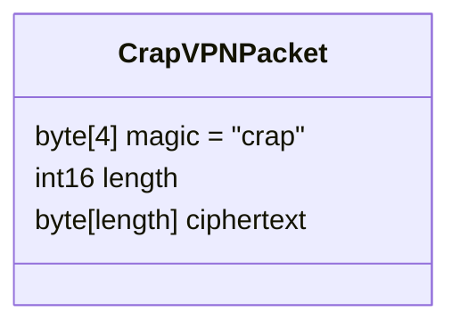

+++ 
draft = true
date = 2024-08-26T21:34:49+02:00
title = "A Custom Wireshark Dissector for a Tunneling Protocol"
+++

In the [previous post](/posts/crapvpn/), I presented a ~crappy~ simple VPN service in Python. In this post I'll show how to modify the packet sniffer [Wireshark](https://www.wireshark.org/) to support the VPN. The post is again intended as a template, this time for the analysis of tunneling protocols, as well as a general guide to common problems.

<!--more-->

## The Protocol

As a recap, the VPN uses a TUN device to encapsulate IP packets in UDP packets. Each UDP packet has the following structure:



The VPN uses XOR for encryption, which means that every byte of plaintext is XORed with a key byte. The key repeats to accommodate plaintexts that are longer than the key itself:



## Wireshark Dissectors

Most Wireshark dissectors are written in C. Their source code can be found in the Wireshark source directory [`/epan/dissectors`](https://github.com/wireshark/wireshark/tree/master/epan/dissectors). However, for personal use and prototyping, Wireshark also supports dissectors written in Lua. By default, Wireshark loads all Lua plugins in the plugin folder, which is located at `~/.local/lib/wireshark/plugins` on Linux and at `%APPDATA%\Wireshark\plugins` on Windows.[^1]

[^1]: You can find the path in Wireshark by going to _Help_ > _About Wireshark_, tab _Folders_ and looking for the entry _Personal Lua Plugins_.

Lua dissectors generally consist of at least four components:
 1. A **protocol definition** containing the short name and the description of the protocol:

    ```lua
    local my_proto = Proto("CrapVPN_UDP", "CrapVPN Protocol (UDP)")
    ```

 1. A **list of fields** containing all the "keys" that will be displayed in the dissection tree. These so-called [`ProtoField`s](https://www.wireshark.org/docs/wsdg_html_chunked/lua_module_Proto.html#lua_class_ProtoField) must be registered centrally to allow filtering on the presence or values of fields:

    ```lua
    local fields = {
        magic_bytes = ProtoField.string("crapvpn.magic", "Magic Bytes"),
        ciphertext_length = ProtoField.uint16("crapvpn.ciphertext_length", "Ciphertext Length", base.DEC),
        ciphertext = ProtoField.bytes("crapvpn.ciphertext", "Ciphertext")
    }
    my_proto.fields = fields
    ```
 1. A **dissector function** implementing the parsing logic. The function is responsible for parsing the `buffer` and adding information to the packet info `pinfo` and the dissector tree `tree`. The `buffer` variable is usually a so-called [`Tvb`](https://www.wireshark.org/docs/wsdg_html_chunked/lua_module_Tvb.html#lua_class_Tvb)[^2] and subsets can be selected by calling the `buffer` object with an offset and a length:

    ```lua
    function my_proto.dissector(buffer, pinfo, tree)
        subtree:add(fields.magic_bytes, buffer(0, 4))
        subtree:add(fields.ciphertext_length, buffer(4, 2))
    end
    ```

 1. A registration in a **dissector table**. This registration tells Wireshark when to call your dissector (here for all packets on UDP port 1337):

    ```lua
    local udp_port = DissectorTable.get("udp.port")
    udp_port:add(1337, my_proto)
    ```

[^2]: `Tvb` appears to stand for "Testy, Virtual(-izable) Buffers" according to [the docs](https://www.wireshark.org/docs/wsar_html/group__tvbuff.html)

### Working With Values

The four components are the minimum and may even suffice for some simple applications. However, if the parsing depends on the result of a field (for example the `length` field), things become a bit more complicated. Contrary to (my?) intuition, it is not possible to query the tree for parsed values. Instead, during dissection one has to call the corresponding methods on the `Tvb` (or `TvbRange`), as shown in the following example:

```lua {hl_lines=[3,11]}
function my_proto.dissector(buffer, pinfo, tree)
    local magic_bytes_buffer = buffer(0, 4)
    if magic_bytes_buffer:string() ~= "crap" then
        -- packet is not for us
        return 0
    end

    subtree:add(fields.magic_bytes, magic_bytes_buffer)

    local ciphertext_length_buffer = buffer(4, 2)
    local ciphertext_length = ciphertext_length_buffer:uint()
    local ciphertext_buffer = buffer(6, ciphertext_length)
    
    subtree:add(fields.ciphertext_length, ciphertext_length_buffer)
    subtree:add(fields.ciphertext, ciphertext_buffer)
end
```

### TCP Reassembly

CrapVPN uses UDP, therefore the dissector must handle each packet separately, as implemented above. In the following, I want to discuss what one must change if CrapVPN were using TCP instead.

TCP operates on _streams_, not packets. Stream reassembly is a rather complex process, but it's already implemented in Wireshark and can be used by dissectors. The API is described in [this article from Wireshark's documentation](https://wiki.wireshark.org/Lua/Dissectors#tcp-reassembly), but I found the description rather bulky. 

From my understanding, the most important things to consider when writing dissectors operating on TCP are (in that order):
 1. The dissector may be called with truncated frames - the easiest solution is to ignore (i.e. `return 0`) buffers that are truncated:

    ```lua
    if buffer:captured_len() ~= buffer:reported_len() then
        return 0
    end
    ```

 1. The dissector may be called for the "middle" packet of your message, so you should figure out _as early as possible_ whether the `buffer` points to the _start_ of a valid packet or not, e.g. by checking for magic bytes. Again, `return 0` to ignore the packet:

    ```lua
    local magic_bytes_buffer = buffer(0, 4)
    if magic_bytes_buffer:string() ~= "crap" then
        -- packet is not for us
        return 0
    end
    ```

 1. The dissector may be called before the entire message as been received, so you should figure out the packet length and check if bytes are missing. If this is the case, set `desegment_len` and `desegment_offset` accordingly, and return, but **do not return `0`**:
    
    ```lua
    local header_length = 6 -- 4 bytes magic + 2 bytes length field
    if buffer:len() < header_length then
        pinfo.desegment_len = DESEGMENT_ONE_MORE_SEGMENT
        pinfo.desegment_offset = 0
        return -- do NOT return 0!
    end
    
    local payload_length = ... -- read the header and the included payload length

    local total_length = header_length + payload_length
    if total_length > buffer:len() then
        pinfo.desegment_len = total_length - buffer:len()
        pinfo.desegment_offset = 0
        return -- do NOT return 0!
    end
    ```

    As a bonus, you can use the `total_length` to correctly update your subtree:

    ```lua
    subtree:set_len(total_length)
    ```

 1. The dissector may be called once for multiple subsequent messages, so you need to split them and parse them separately. This is the most complicated one, and I don't have an ideal solution yet, but wrapping the dissector in a `repeat ... until` loop works fairly well:

    ```lua {hl_lines=["1-2",9,"13-16"]}
    local offset = 0
    repeat
        -- ... do all the dissections on buffer() here, including calculating the total_length

        -- similar to before, but jump to the offset instead of the beginning of the packet
        local total_length = header_length + payload_length
        if total_length > buffer:len() then
            pinfo.desegment_len = total_length - buffer:len()
            pinfo.desegment_offset = offset -- <== this is different
            return
        end

        offset = offset + total_length
        buffer = buffer(total_length):tvb()
    until buffer:len() == 0
    ```

## Calling Sub-Dissectors

```lua
-- define once, centrally
local ip_dissector = Dissector.get("ip")

-- during dissection, call subdissector:
pcall(Dissector.call, ip_dissector, plaintext_tvb, pinfo, tree)
```

## Adding Preferences

```lua
-- define once, centrally
my_proto.prefs.key = Pref.string("Key", "", "Key used for decryption (provided as hex string)")

--- value can be accessed as:
my_proto.prefs.key
```

## Full Source Code

<details>
<summary>Full Source Code (UDP)</summary>

</details>

<details>
<summary>Full Source Code (TCP)</summary>

</details>

