In this blog post I want to showcase a recent project of mine: I took [IPv4 port
scans gathered by Patrick Sattler et al. (Technische Universität
München)](https://mediatum.ub.tum.de/1723389) and visualized it as a _zoomable_
Hilbert map using [Leaflet](https://leafletjs.com/). Visualization of the
Internet using the Hilbert curve is not a new approach, as it has been suggested
and implemented by several people in the past. Nevertheless, all existing
implementations that I looked at were lacking interactivity, especially the
ability to zoom into subnets for closer inspection. That's why I built
https://hilbert.app.jonaslieb.de/!

### How It Works

A short introduction to Hilbert curves: Hilbert curves are a way to map a
one-dimensional space into a higher-dimensional space, in our case: 2D. This is
useful because computer networks can be seen as a one-dimensional space of
numbers/IP addresses: the first IP address is 0.0.0.0, then comes 0.0.0.1,
0.0.0.2, ... 0.0.0.255, 0.0.1.0, 0.0.1.1, and so on, up until 255.255.255.255.
The second useful property of the Hilbert curve is its self-similarity, which in
our case means: It supports "infinite zoom". This is shown, for example, in the
following animation taken from Wikipedia:

 

To see how this applies to computer networks, take the following three images:
The first one shows the entire IPv4 address space (denoted as 0.0.0.0/0):

If we zoom in a little bit, we will see that 0.0.0.0/0 can actually be divided
into four subnets: 0.0.0.0/2, 64.0.0.0/2, 128.0.0.0/2, and 192.0.0.0/2.

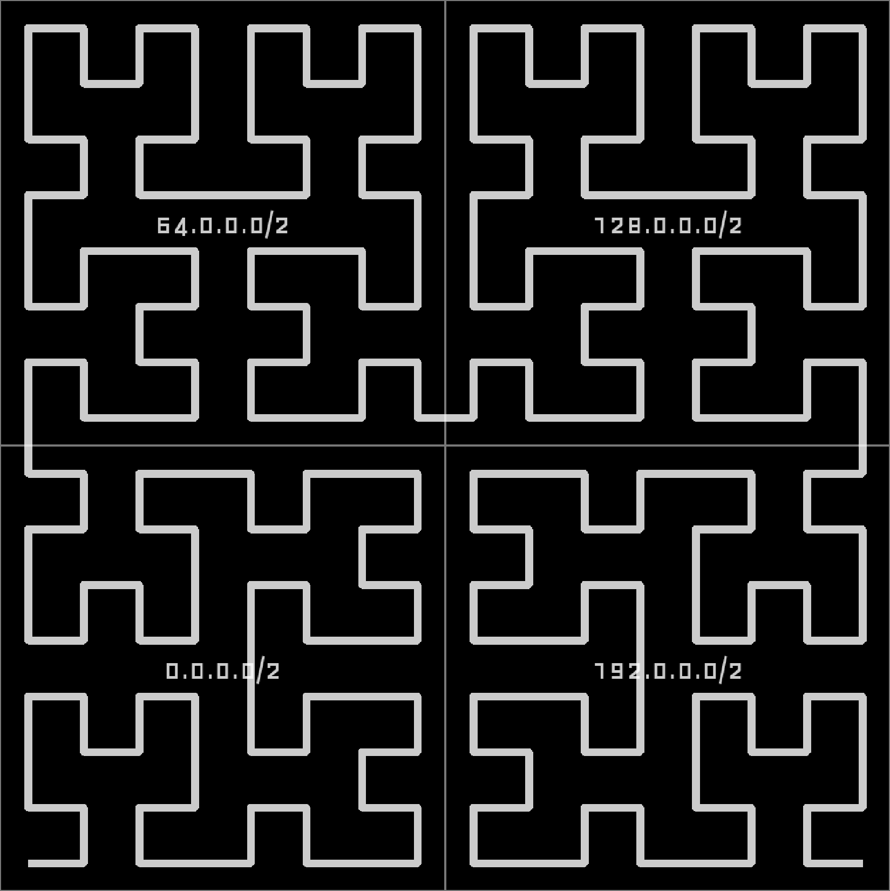

Zooming in further, in the lower right corner, we find that 0.0.0.0/2 actually
consists of 0.0.0.0/4, 16.0.0.0/4, 32.0.0.0/4, and 48.0.0.0/4:

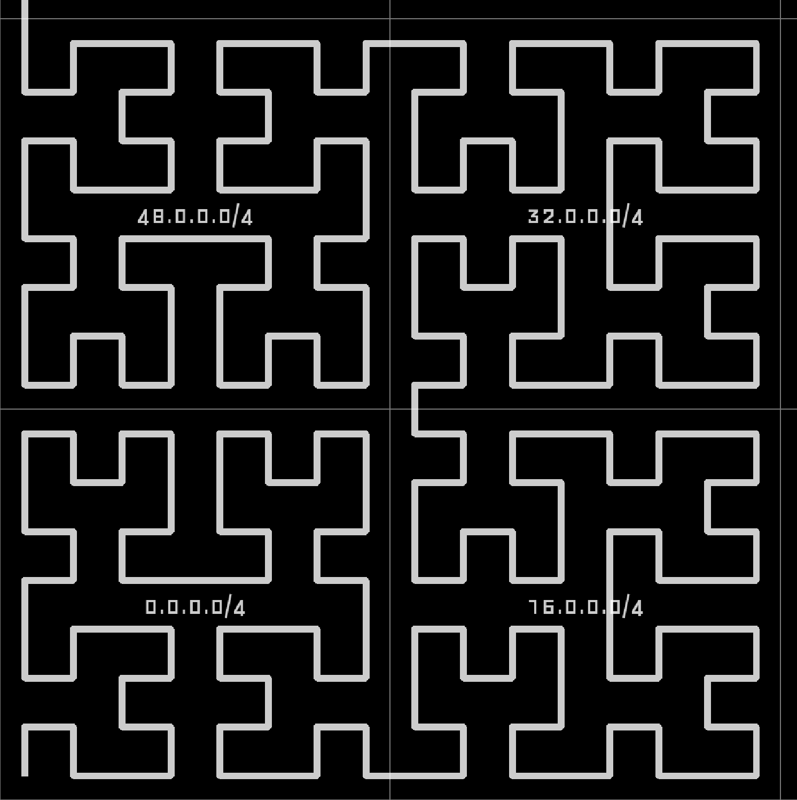

You see: every network covers some space on the entire curve and we can zoom in
up until each point on the curve corresponds to a single IPv4 address:

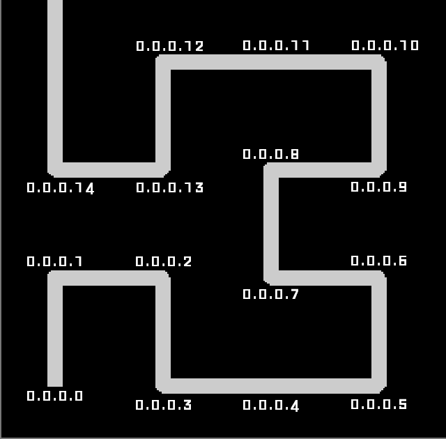

In my implementation I am visualizing the results of a port scan for a single
port. All IP addresses where that port is open will be indicated as a bright
spot on the map, all others will be left dark. And that is what the entire
Internet looks like for TCP port 443 (used by HTTPS):

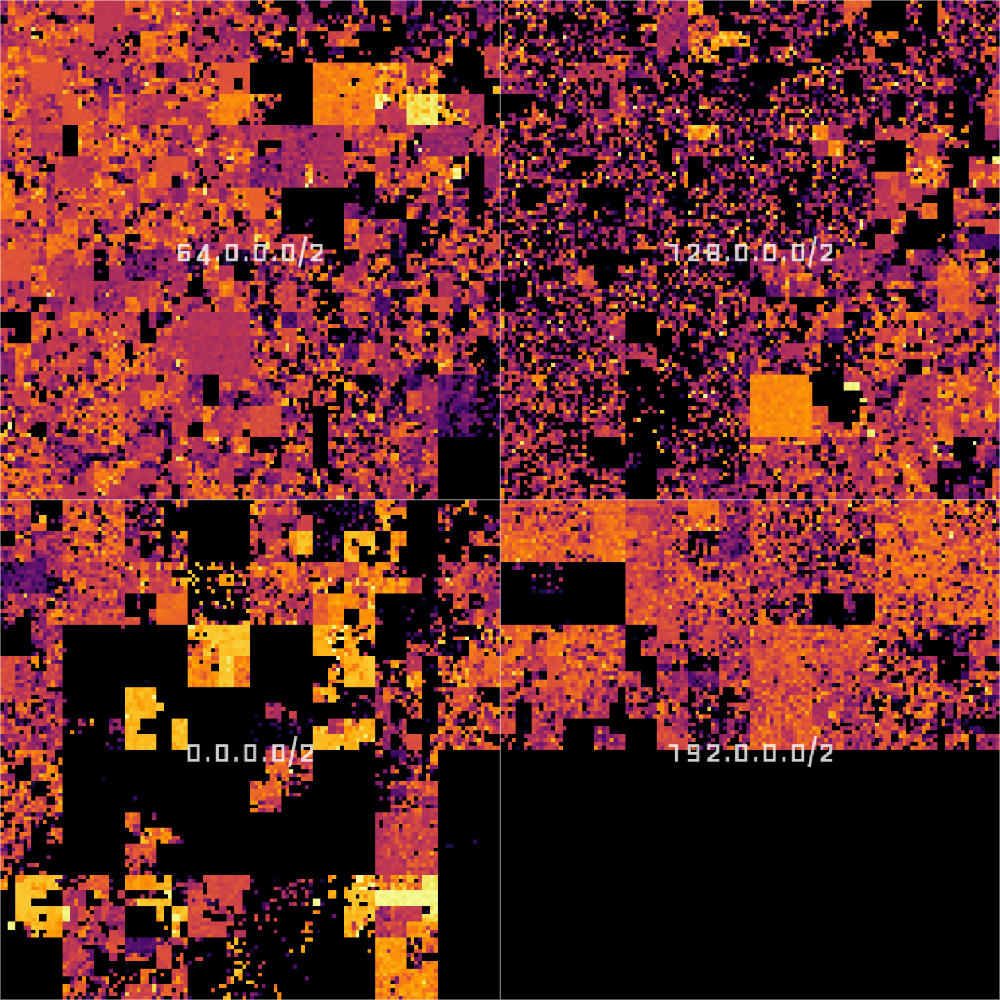

## Implementation

Going into detail here would exceed this post's scope, but I implemented the
frontend using [Leaflet](https://leafletjs.com/) and the back-end tile server in
[Flask](https://flask.palletsprojects.com/en/stable/), served by
[uWSGI](https://uwsgi-docs.readthedocs.io/en/latest/), running inside a
Kubernetes pod hosted on Hetzner. I only assigned limited resources, so I expect
some delays and/or the occasional [Hug of
Death](https://en.wikipedia.org/wiki/Slashdot_effect).

The map is interactive and can be zoomed up to the /24 level. A click on the map
brings up a popup containing GeoIP information from a [database provided by
IPLocate](https://github.com/iplocate/ip-address-databases). One can choose
between different datasets using a layer selector at the top right:

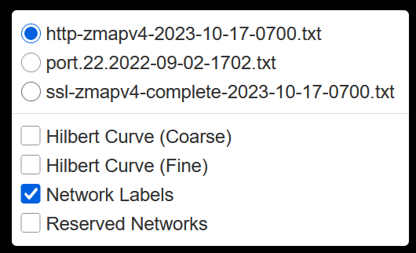

All layers are static. The datasets were published in [Packed to the Brim:
Analyzing Highly Responsive Prefixes on the Internet -
Dataset](https://mediatum.ub.tum.de/1723389) by Patrick Sattler et al. of
Technische Universität München (TUM) under the [Creative Commons CC BY 4.0
License](http://creativecommons.org/licenses/by/4.0).

## Exploration

Now let's dive into the data. Exploration is actually
surprisingly fun and I want to show you some things to discover!

First, the big black block in the lower right corner: These are 
addresses reserved for multicast (224.0.0.0/4) and other (unspecified) purposes
(240.0.0.0/4):

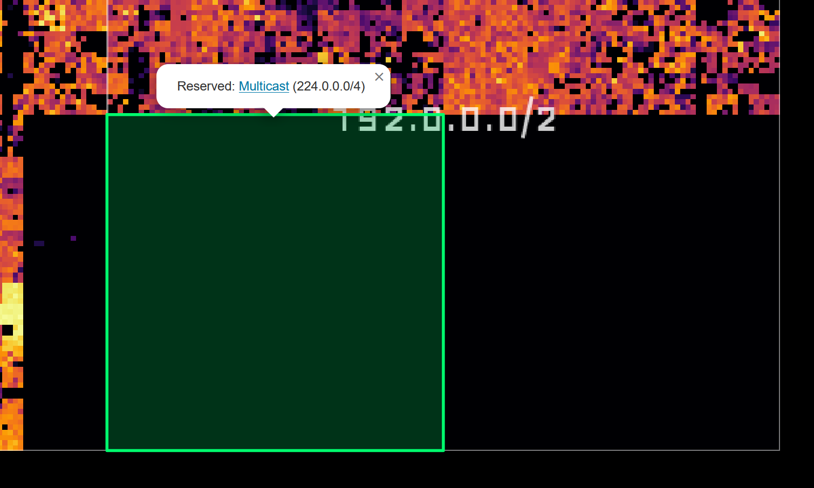

The little square almost dead center shows the loopback address space
127.0.0.0/8:

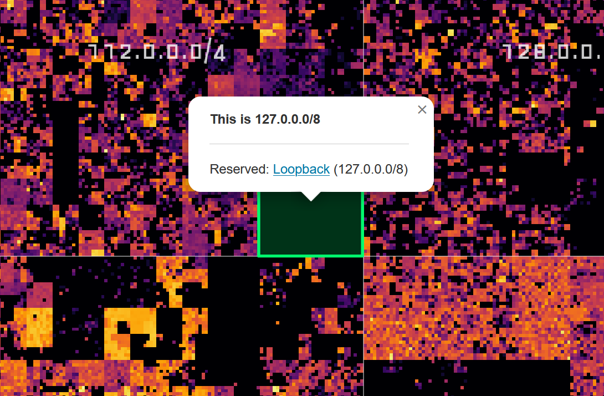

Many of the black patches in the lower left quadrant are networks belonging to
the United States Department of Defense:

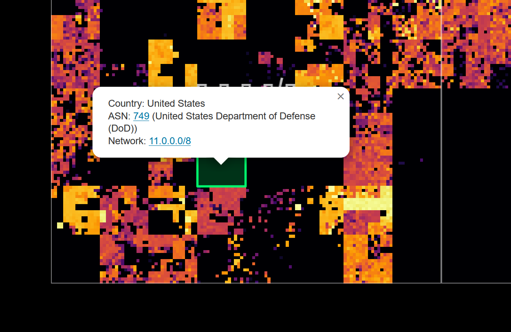

Zooming in further reveals smaller networks, such as this Comcast network, which
is not especially bright, but surprisingly even:

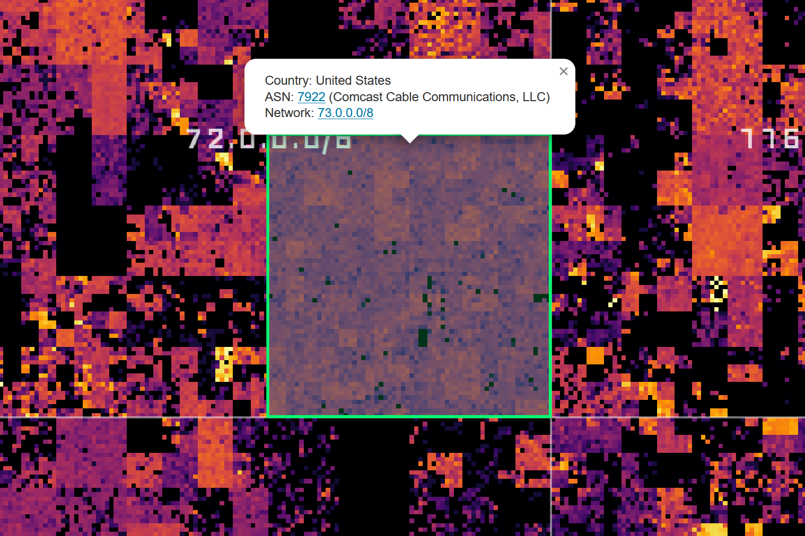

Companies that provide cloud services also light up very brightly, for example, Amazon/AWS:

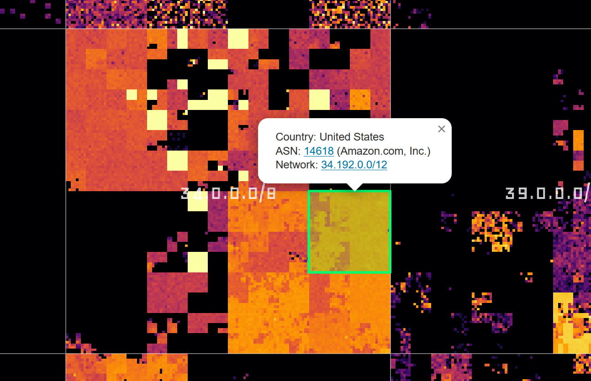

Or Google:

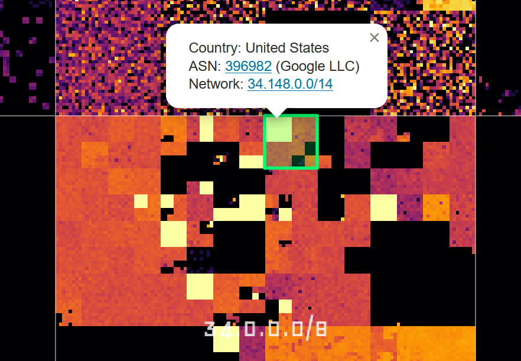

And finally, a rather quiet-looking network:

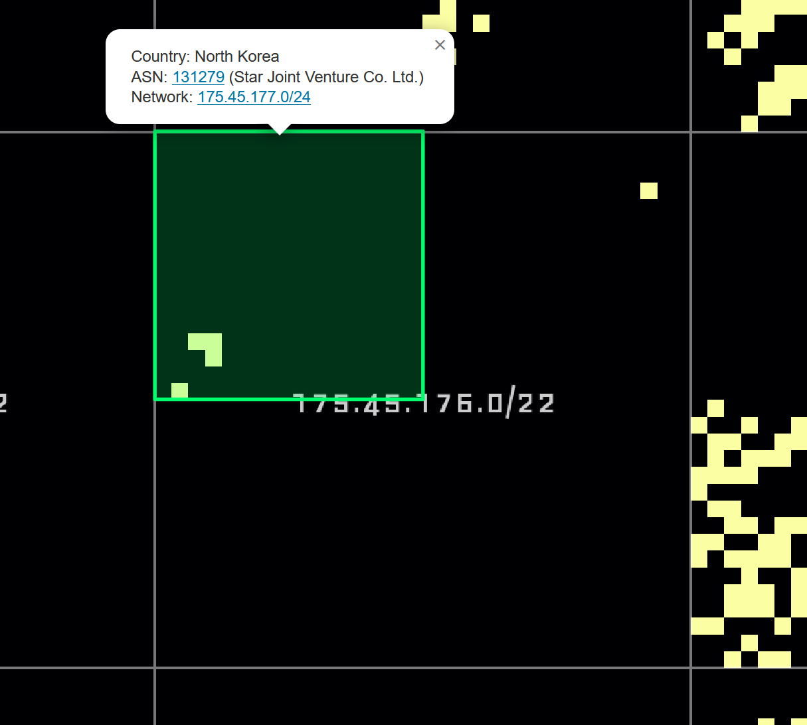

## Closing Words

I could (and have) spent hours browsing this map and I hope some of you find it
interesting too! Be kind to the backend; it runs on limited resources. Other
than that: have fun!

<a class="call-to-action" href="https://hilbert.app.jonaslieb.de/">Visit the interactive Hilbert map at hilbert.app.jonaslieb.de</a>