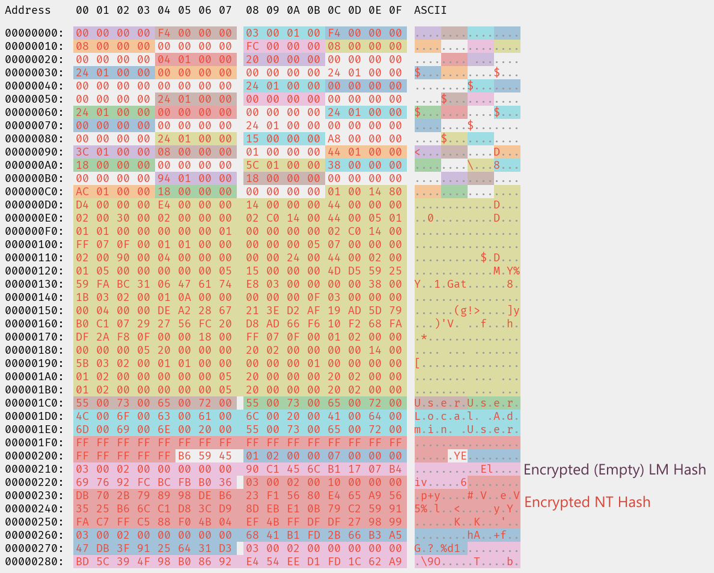

I recently fiddled around with Window's built-in command
[`nltest`](https://learn.microsoft.com/en-us/previous-versions/windows/it-pro/windows-server-2012-r2-and-2012/cc731935(v=ws.11))
and noticed that `nltest /user:<username>`, when executed as an Administrator,
yields some interesting information about the requested user:


The two fields `LmOwfPassword` and `NtOwfPassword` spiked my interest. The
abbreviation "Owf" typically stands for _one-way-function_, which is synonymous
with _hash function_ or even _hash value_. If `LmOwfPassword` and
`NtOwfPassword` corresponded to the user's LM and NT hash, `nltest` might be
another option for dumping the
[SAM](https://en.wikipedia.org/wiki/Security_Account_Manager) :thinking:

<!-- more -->

I then used [SharpSAMDump](https://github.com/jojonas/SharpSAMDump/) to dump the SAM the "conventional way" which yielded[^secret]:

[^secret]: To save you some computing-time: the password for `User` is `secret`.

```cmd {hl_lines=6}
C:\Windows\System32>C:\Users\user\Desktop\SharpSAMDump.exe
Administrator:500:aad3b435b51404eeaad3b435b51404ee:8846f7eaee8fb117ad06bdd830b7586c:::
Guest:501:aad3b435b51404eeaad3b435b51404ee:31d6cfe0d16ae931b73c59d7e0c089c0:::
DefaultAccount:503:aad3b435b51404eeaad3b435b51404ee:31d6cfe0d16ae931b73c59d7e0c089c0:::
WDAGUtilityAccount:504:aad3b435b51404eeaad3b435b51404ee:17cfc1d9cd213aa80dabb9b18535494d:::
User:1000:aad3b435b51404eeaad3b435b51404ee:878d8014606cda29677a44efa1353fc7:::
```

Compare this to `LmOwfPassword` and `NtOwfPassword` and you'll find that they don't match at all:

```
LmOwfPassword: ebf392d4 44274741 b496e747 b8508223
NtOwfPassword: 5192b7a2 93e9a4c4 5b756fd6 31d3cb21
```

So what's going on here?

## Staring at the SAM

My next idea was to inspect the raw values in the SAM. I used
[NtObjectManager](https://www.powershellgallery.com/packages/NtObjectManager/1.1.32)
to access the corresponding registry key:

```powershell
PS C:\> Import-Module NtObjectManager
PS C:\> Enable-NtTokenPrivilege SeBackupPrivilege
PS C:\> New-PSDrive -PSProvider NtObjectManager -Name SEC -Root ntkey:MACHINE
PS C:\> $key = Get-Item SEC:\SAM\SAM\Domains\Account\Users\000003E8
PS C:\> $key["V"].Data | Format-HexDump

[...]
```

The following image shows the SAM entry with the different fields colored differently:



The user's LM/NT hashes are stored in the two entries labeled with "Encrypted
LM/NT Hash". The encryption algorithm consists of two layers:
 1. encryption with DES-ECB-LM, with a key derived using the user's RID (see [[MS-SAMR]
2.2.11.1.1](https://learn.microsoft.com/en-us/openspecs/windows_protocols/ms-samr/a5252e8c-25e7-4616-a375-55ced086b19b))
 2. additional encryption with AES-CBC, using a secret stored in a different registry
    key

However, neither the attributes in the SAM nor any of the intermediate
products matched the values outputted as `LmOwfPassword` and `NtOwfPassword`.

## Bigger Guns

So I dug deeper into `nltest` using [Ghidra](https://ghidra-sre.org/) and
[WinDbg](https://learn.microsoft.com/en-us/windows-hardware/drivers/debugger/).
The output is apparently generated by a function named `PrintUserInfo`. The
function first looks up the RID based on the name passed via the `/user:`
option. It then opens the registry key
`SAM\SAM\Domains\Account\Users\Names\<hex-rid>` and prints attributes from the
`F` and the `V` subkeys. Most attributes are printed as-is, but before printing
the `LmOwfPassword` and `NtOwfPassword` values, the function applies the
functions `SystemFunction025` and `SystemFunction027` respectively:


In the debugger one can see that `SystemFunction025` and `SystemFunction027`
refer to the same function (forwarded from `advapi32.dll`to `cryptsp.dll`) which
is the DES-ECB-LM decryption routine[^reactos]!

[^reactos]: You can find an implementation of the key derivation and DES-ECB-LM
    in the [ReactOS source
    code](https://doxygen.reactos.org/df/d13/sysfunc_8c_source.html#l00435).

Yes - you read that correctly. `nltest` attempts to DES-decrypt an AES-encrypted
value :facepalm: Perhaps `nltest` was originally intended to print a user's
LM/NT hash, but was never updated when an additional layer of encryption was
introduced.

## Exploit?

But can we take the `LmOwfPassword`/`NtOwfPassword` and derive the LM/NT hash
nonetheless? My next idea was to implement something like the following (hoping
I would find another leak for the key):


According to the motto "implement before you think", I wrote [a
script](script.py) to implement the DES encryption, hoping it would yield the
raw value as stored in the SAM:

```shell-session
$ python3 script.py -r 0x3e8 '5192b7a2 93e9a4c4 5b756fd6 31d3cb21'
03 00 02 00 10 00 00 00 DB 70 2B 79 89 98 DE B6
```

That's neat, but the output contains an 8-byte header and only eight bytes of
the "ciphertext"... And even worse: The eight ciphertext bytes correspond to the
first half of the IV used for AES-CBC :frowning:

## Conclusion

I am glad to have solved the mystery of `nltest /user:`'s output, specifically
of the `LmOwfPassword` and `NtOwfPassword` fields, even if the result is a bit
disappointing (for a Red-Teamer). While the fields are in fact derived from the
SAM attributes corresponding to the user's encrypted LM/NT hashes, I am pretty
sure that it's not possible to recover the underlying "real" hash values.
Nevertheless, it would be really interesting to learn more about the tool's
history (maybe something for [@Raymond
Chen](https://devblogs.microsoft.com/oldnewthing/author/oldnewthing)? :wink:),
and I will certainly keep exploring `nltest`'s other features.

