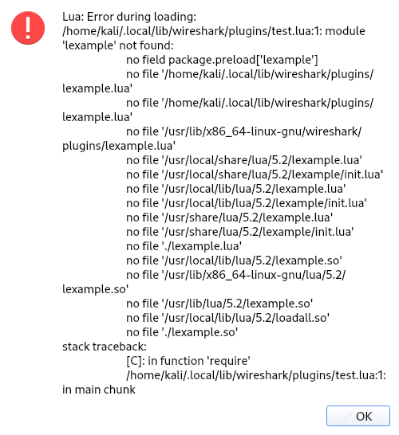

Another way to step up your Wireshark game is to enhance Lua dissectors with features implemented in C/C++. Lua has a wonderful [C API](https://www.lua.org/pil/24.html) that allows to seamlessly bring the power of C libraries to Lua code. I found this especially helpful when working with cryptography, as Wireshark does not provide any built-in cryptographic extensions to be used in dissectors. With this post I would therefore like to explain how to wrap C libraries for using them in Lua and how to use pre-packaged Lua libraries from [LuaRocks](https://luarocks.org/).

<!--more-->



The first step when extending Lua is figuring out the Lua version used by Wireshark. You can find it through the dialogue _Help_ > _About Wireshark_, in the paragraph "Compiled with...":


In my case this was Lua version 5.2.4, and thus I'll be using that version in the examples. Make sure to adapt the commands and documentation for your version of Lua.

Native modules come in the form of shared libraries (`.so` files on Linux, `.dll` files on Windows). However, you will not be able to just call arbitrary shared libraries as they need to follow a few rules mandated by the Lua C API. That's why you will usually have to wrap existing libraries so that they can be used with Lua. In the first section of this post, I want to show you how you can compile and use such a wrapper yourself, then in the second part I will show how to install and use wrappers that other people published as packages in the [LuaRocks](https://luarocks.org/) repository. If that's all you need, feel free to skip ahead.

## Writing and Compiling a Wrapper Yourself

In order to develop a C wrapper you will header files corresponding to your Lua version. On Debian-based Linux distributions like Ubuntu or Kali Linux, you can install the development package for Lua version 5.2 through the `apt` package manager:

```shell-session
$ sudo apt install liblua5.2-dev
```

This will install [`lua.h`](https://www.lua.org/source/5.3/lua.h.html) and [`lauxlib.h`](https://www.lua.org/source/5.3/lauxlib.h.html) which provide the signatures of all `lua_` and `luaL_` functions. 

### C Code

Sorry to break it to you, but you might need to write some C code. As I want to focus on the benefits of integrating C libraries _in Wireshark dissectors_, I will not go into details on the C API. Instead, I highly encourage you to take a look at the [corresponding chapter in the Lua documentation](https://www.lua.org/pil/24.html), as it is very well written and provides some background on the API.

The following C file implements a library that exposes a single function: `lexample:greet("<name>")` which prints `Hello <name>!` to stdout:



You might have noticed that the C code contains only one exported (i.e. non-`static`) function called `luaopen_lexample`. This function _must_ be called `luaopen_`, followed by the shared libraries name (here: `lexample.so` &rArr; `luaopen_lexample`). It registers an array of function pointers using [`luaL_newlib`](https://www.lua.org/manual/5.2/manual.html#luaL_newlib). The (only) registered function `lexample_greet` fetches the `name` from the first element of the stack, makes sure it's a string and prints the greeting.

If you save the code as `lexample.c`, you can compile this library with the following command[^1]:

```shell-session
$ gcc $(pkg-config --cflags --libs lua-5.2) -fPIC -shared -o lexample.so lexample.c
```

Or explicitly in two steps (also useful for working with Make):

```shell-session
$ gcc -c $(pkg-config --cflags --libs lua-5.2) -fPIC -o lexample.o lexample.c
$ ld -fPIC -shared -o lexample.so lexample.o
```

[^1]: For larger projects, I found it handy to work with CMake, you can find an example [`CMakeLists.txt` file here](example/CMakeLists.txt), which I adapted from [this blog post](https://nachtimwald.com/2014/07/12/wrapping-a-c-library-in-lua/).


It is not necessary to link against any Lua library, as this is done _dynamically_.


You can test your first library through the `lua` command-line prompt (which you might need to install with `sudo apt install lua5.2`):

```shell-session
$ lua
Lua 5.2.4  Copyright (C) 1994-2015 Lua.org, PUC-Rio
> example = require("lexample")
> example.greet("Jonas")
Hello Jonas!
```

### Lua Tables / Userdata

Quite often, you will want to keep state in an object instance created in C code and used by other C functions. In the Lua C API this is handled through _userdata_. At its heart, userdata is a memory region allocated through `lua_newuserdata` that is associated with a Lua metatable. For details about metatables, I again refer you to the [documentation](https://www.lua.org/pil/13.html), but in this case metatables serve two purposes:
 1. They allow attaching methods to userdata objects.
 1. They can be used as an "identity" to prevent arbitrary userdata objects from being passed to methods.

I will spare you the details on how to implement this correctly in C and just present to you a finished implementation:

<details>
<summary>Full Source Code: <code>lxor.c</code></summary>

</details>

The code implements a library called `lxor` which you can compile and use like this:

```shell-session
$ gcc $(pkg-config --cflags --libs lua-5.2) -fPIC -shared -g -o lxor.so lxor.c
$ lua
Lua 5.2.4  Copyright (C) 1994-2015 Lua.org, PUC-Rio
> xor = require("lxor")
> cipher = xor.new("0AB1BC")
> print(cipher:decrypt("x$.]-cg.0]&b"))
Hello World!
```

### Lua Path & CPath

If you try to use a library from a different working directory than where the shared library is located, you will get the following error message:

```shell-session
$ lua            
Lua 5.2.4  Copyright (C) 1994-2015 Lua.org, PUC-Rio
> example = require("lexample")
stdin:1: module 'lexample' not found:
        no field package.preload['lexample']
        no file '/usr/local/share/lua/5.2/lexample.lua'
        no file '/usr/local/share/lua/5.2/lexample/init.lua'
        no file '/usr/local/lib/lua/5.2/lexample.lua'
        no file '/usr/local/lib/lua/5.2/lexample/init.lua'
        no file '/usr/share/lua/5.2/lexample.lua'
        no file '/usr/share/lua/5.2/lexample/init.lua'
        no file './lexample.lua'
        no file '/usr/local/lib/lua/5.2/lexample.so'
        no file '/usr/lib/x86_64-linux-gnu/lua/5.2/lexample.so'
        no file '/usr/lib/lua/5.2/lexample.so'
        no file '/usr/local/lib/lua/5.2/loadall.so'
        no file './lexample.so'
stack traceback:
        [C]: in function 'require'
        stdin:1: in main chunk
        [C]: in ?
```

You might encounter a similar error message in Wireshark:



Lua searches for Lua libraries (which can also be `require`d) and shared libraries in specific directories:
 * Lua Path: Used for finding `.lua` files, can be specified through the environment variable `LUA_PATH` or during runtime by modifying `package.path`
 * Lua C Path: Used for finding shared libraries, can be specified via `LUA_CPATH` or `package.cpath`

I have yet to find the perfect project structure. Currently, I'm copying the compiled `.so` files into the local user plugin path (`~/.local/lib/wireshark/plugins`) and then modify `package.cpath` accordingly at the beginning of my script:

```lua
package.cpath = package.cpath .. ";" .. Dir.personal_plugins_path() .. "/?.so"
```

Alternatively, you can put this line into `init.lua`, where it will be executed on each startup.

### Passing Values Between Lua And C

While it is (with a few hacks) possible to access `Tvb` userdata objects in C, I do not recommend doing so, as the C API for getting raw data given a `Tvb` userdata object is internal and may thus be subject to change. The Lua API for getting raw data given a `Tvb` userdata object however is documented. You can convert a `Tvb` or a `TvbRange` to a Lua string with the `:raw()` method:

```lua
local input = buffer:raw()
local output = mylibrary.myfunction(input)
```

Lua strings are simple sequences of eight-bit characters (including `\x00` bytes) and therefore perfectly suited for passing binary data. You can then process the string in C code like this:

```c {hl_lines=["7","9"]}
static int mylibrary_myfunction(lua_State *L) {
    const uint8_t *input;
    size_t input_length;
    uint8_t* output;
    size_t output_length;

    input = (uint8_t *)luaL_checklstring(L, 1, &input_length);
    // ... calculate output and output_length, then:
    lua_pushlstring(L, output, output_length);
    return 1;
}
```

If you need to do further processing in Wireshark, you can use the output to create a new `Tvb` like this:

```lua
local bytearray = ByteArray.new(output, true)
local buffer2 = bytearray:Tvb("<some name>")
```

I have already used this concept in the context a [previous blog post](../wireshark-vpn/#calling-sub-dissectors).

## Integrating with the LuaRocks Package Manager

It is not always necessary to reinvent the ~wheel~ wrapper, sometimes you might get away with using other people's packages instead. For Lua, [LuaRocks](https://luarocks.org/) is the go-to package manager with over 4600 modules at the time of writing. On Debian, Ubuntu and Kali Linux you can install the LuaRocks CLI via the `apt` package manager (make sure to match your Lua version):

```shell-session
$ sudo apt install luarocks-5.2
```

LuaRocks packages, aptly named _rocks_, can be installed via one of the following commands:

```shell-session
$ luarocks install <package> # for global installation
$ luarocks install --local <package> # for local/non-root installation
```

The paths where `luarocks` places the files are not in Wireshark's default C path (`LUA_CPATH`/`package.cpath`). This can be fixed by placing the following line on top of your script:

```lua
require("luarocks.loader")
```

This line makes sure that subsequent `require` calls pick up the installed _rocks_. If you are really determined about using LuaRocks, you can even place this line in `init.lua`, allowing you to `require` arbitrary installed _rocks_ in all your dissector scripts.


## Conclusion

During protocol analysis you might encounter complicated algorithms like encryption, compression, or encoding. Lua by default does not provide any helpers, but Lua's C API allows to easily integrate libraries written in C. This post showed how to write a wrapper and especially how to use it in Wireshark. Additionally, it explained how to use existing Lua wrappers published via the LuaRocks package manager.

I hope that this post will make a few peoples' lifes easier!