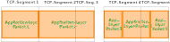
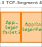

In [my previous posts of this series](/series/wireshark-dissector-guides/), I focused on analyzing UDP-based protocols. However, many real-life network protocols rely on TCP for reliability, ordering and error checking. Unfortunately, TCP's _stream_-like nature, compared for example to UDP's discrete _datagrams_, creates unique challenges for packet analysis. This post will discuss how to handle these complexities in Wireshark dissectors. I will build on [Wireshark's documentation regarding TCP desegmentation](https://wiki.wireshark.org/Lua/Dissectors#tcp-reassembly) and suggest effective patterns for implementing TCP-aware dissectors in Lua.

<!--more-->

### IP Fragmentation and TCP Segmentation

While IP and UDP transmit packets in discrete _datagrams_ smaller than the MTU, TCP acts on _streams_. An application pushes bytes into a TCP stream using `send()` and receives bytes using `recv()`. TCP (more specifically, the operating system's implementation of TCP) guarantees that each byte passed to `send()` will eventually show up at the other endpoint's `recv()`, as long as the connection is intact. It also guarantees that all bytes are received in the exact order that they have been sent. However, there is _no_ guarantee that a byte array passed to `send()` will be received in one piece[^1]. This implies that there is no such thing as a _TCP packet_ on the application layer. This fact is crucial for understanding TCP.


There is no such thing as a TCP _packet_ from an application's perspective. There are only TCP _streams_ which can be visualized as "byte queues".


[^1]: Nor does it actually guarantee that the entire array is handled in one `send()` call.

This means that it is up to the application to "pack" and "unpack" packets. This is commonly done by including a packet length early in the packet's header or by separating packets with delimiters. Receiver implementations must identify packet boundaries and extract discrete packets from the continuous stream.

### Challenges for Wireshark Dissectors

By default, Wireshark calls the dissector's `dissect` function exactly once per (Ethernet) frame.  Each frame usually contains one TCP segment, however segment boundaries may or may not align with the start of an application-layer packet (except for the first one), as depicted in the following figure:



This example illustrates how five differently-sized application-layer packets could be transmitted using TCP. As the packet sizes do not match the maximum segment size, packets are scattered across multiple segments. Note that the reality could look even more chaotic, as TCP segments might arrive out of order. For that reason, Wireshark dissectors working with TCP streams cannot naively dissect frames one-by-one. Instead, they first have to reassemble the segments to a stream, then parse the stream and build packets from it, just like the receiving endpoint.

### Wireshark's Reassembly API

Fortunately, Wireshark can assume the operating system's role and reassemble TCP streams from their segments, taking the order into account. The API is described in [this article from Wireshark's documentation](https://wiki.wireshark.org/Lua/Dissectors#tcp-reassembly), but I found it rather difficult to understand at first, so here is my interpretation:

While Wireshark calls `dissect` once per frame, as stated earlier, the `dissect` function does not have to perform actual dissection on each invocation. Instead, it also has the following options:
 <!-- 1. It can dissect the payload as usual. -->
 1. It can return `0` to ignore the frame.
 1. It can set `pinfo.desegment_len` to `DESEGMENT_ONE_MORE_SEGMENT` and return — in this case Wireshark waits for the next TCP segment and then calls `dissect` with a TVB containing the payload in the original segment and the subsequent segment.
 1. It can set `pinfo.desegment_len` to an integer number of bytes `n` and return — in this case Wireshark reassembles segments until the buffer contains `n` more bytes and then calls `dissect` again with a TVB containing the original buffer as well as the requested bytes.


Once you have chosen the latter option (set `pinfo.desegment_len` to a number of bytes), you cannot change your decision in a later invocation of `dissect`, i.e. you can't wait for "even more" bytes.


This API allows to efficiently process TCP streams. The following list revisits the misalignment scenarios described before and proposes effective patterns to handle these scenarios:

 1. The segment may start in the "middle" of the application packet (see segment 3 and 5 in the example):
 
    

    To work around this, you should figure out _as early as possible_ whether the `buffer` points to the _start_ of a valid packet or not, e.g. by checking for magic bytes. If not, `return 0` to ignore the packet:

    ```lua
    local magic_bytes_buffer = buffer(0, 4)
    if magic_bytes_buffer:string() ~= "crap" then
        -- packet is not for us
        return 0
    end
    ```

 1. The dissector may be called before the entire packet has been received (see segment 2 and 4 in the example):

    
 
    To prevent incomplete dissections, you should figure out the packet length and check if/how many bytes are missing. If this is the case, set `pinfo.desegment_len` to the number of missing bytes and `pinfo.desegment_offset` to the packet's starting offset, and return anything **except `0`**:
    
    ```lua
    local offset = 0

    local header_length = 6 -- 4 bytes magic + 2 bytes length field
    if buffer:reported_len_remaining(offset) < header_length then
        -- follow-up with one more segment
        pinfo.desegment_len = DESEGMENT_ONE_MORE_SEGMENT
        pinfo.desegment_offset = 0
        return -- do NOT return 0!
    end
    
    local payload_length = ... -- read the header and the included payload length
    offset = offset + header_length

    if buffer:reported_len_remaining(offset) < payload_length then
        -- follow-up with N more bytes
        pinfo.desegment_len = payload_length - buffer:reported_len_remaining(offset)
        pinfo.desegment_offset = 0
        return -- do NOT return 0!
    end
    ```

 1. The dissector may be called once for multiple subsequent messages (see segment 4):
 
    

    You will need to split them and parse them separately. A common pattern used in Wireshark dissectors is to keep a variable called `offset` which contains the number of bytes already handled:
    
    ```lua
    local offset = 0

    while buffer:reported_len_remaining(offset) > 0 do
        local packet_start = offset

        -- ... parse the header and update offset, for example:
        local payload_length = buffer(offset, 4):uint()
        offset = offset + 4

        if buffer:reported_len_remaining(offset) < payload_length then
            pinfo.desegment_len = payload_length - buffer:reported_len_remaining(offset)
            pinfo.desegment_offset = packet_start
            return
        end

        -- do something with the payload, then:
        offset = offset + payload_length
    end
    ```

I have combined all of these patterns in the following implementation template:

<details>
<summary>TCP Dissector Template</summary>

</details>

## Conclusion

Handling TCP streams imposes a few challenges on Wireshark dissectors, which usually process frames one-by-one. Luckily, Wireshark has built-in desegmentation capabilities which can be used by Lua dissectors. The API takes some time getting used to, but is successfully used by numerous built-in dissectors. This post augments the official documentation with examples and common implementation patterns.