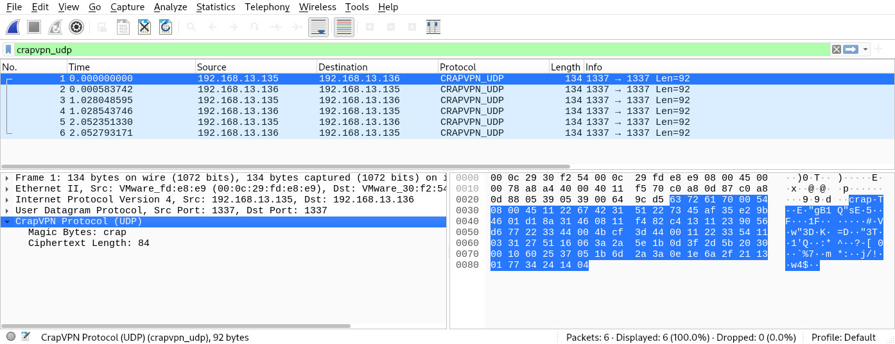
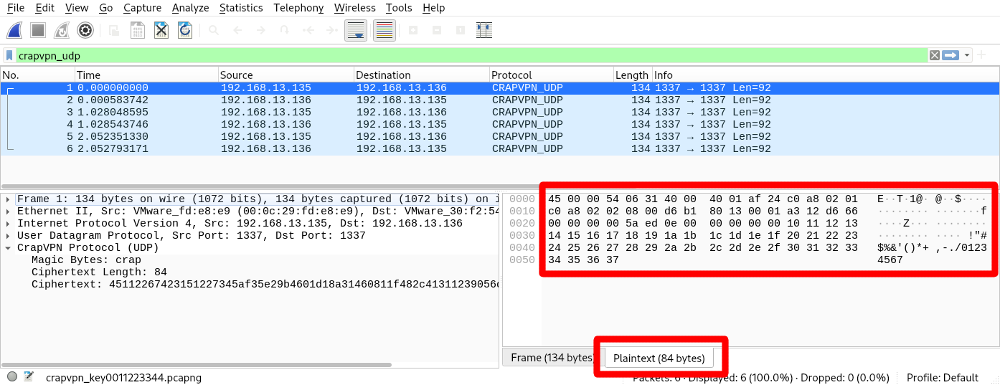
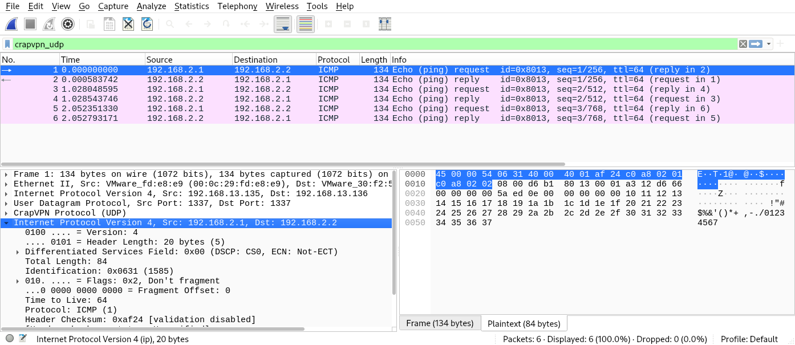
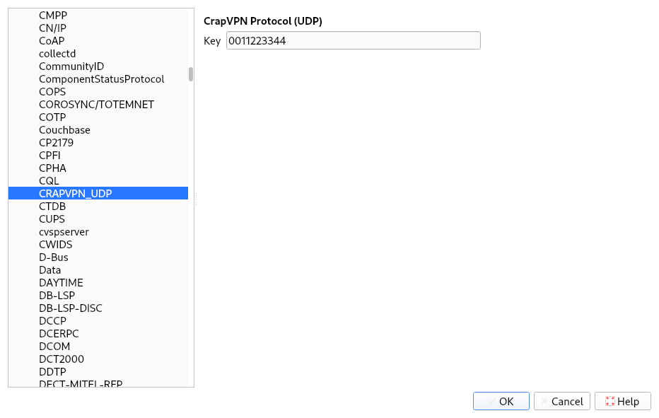

In the [previous post](../python-vpn/), I demonstrated how to implement a simple VPN service in Python. In this post I'll show how to write a plugin for the packet sniffer [Wireshark](https://www.wireshark.org/) in order to analyze the VPN. The post is again intended as a general template, this time for the creation of Wireshark dissectors, with a focus on tunneling protocols.

<!--more-->



## Recap: The Example VPN

As a recap, the VPN described in the [previous post](../python-vpn/) uses a TUN device to encapsulate IP packets in UDP packets, with each UDP packet having the following structure:

```goat {width=700}
 0                   1                   2                   3
 0 1 2 3 4 5 6 7 8 9 0 1 2 3 4 5 6 7 8 9 0 1 2 3 4 5 6 7 8 9 0 1
+-+-+-+-+-+-+-+-+-+-+-+-+-+-+-+-+-+-+-+-+-+-+-+-+-+-+-+-+-+-+-+-+
|                        Magic (4 bytes)                        |
+-+-+-+-+-+-+-+-+-+-+-+-+-+-+-+-+-+-+-+-+-+-+-+-+-+-+-+-+-+-+-+-+
|        Length (2 bytes)       |       Reserved (2 bytes)      |
+-+-+-+-+-+-+-+-+-+-+-+-+-+-+-+-+-+-+-+-+-+-+-+-+-+-+-+-+-+-+-+-+
|                                                               |
+                  Ciphertext (variable length)                 +
|                                                               |
+-+-+-+-+-+-+-+-+-+-+-+-+-+-+-+-+-+-+-+-+-+-+-+-+-+-+-+-+-+-+-+-+
```

The VPN uses XOR for encryption, which means that every byte of plaintext is XORed with a key byte. The key repeats to accommodate plaintexts that are longer than the key itself:




If you want to follow along but don't want to set up/run the VPN client, you can find the PCAP file used for this post [here](crapvpn_key0011223344.pcapng). The XOR key used for encryption is `00 11 22 33 44`.


## Wireshark Dissectors

Most Wireshark dissectors are written in C. Their source code can be found in the Wireshark source directory [`/epan/dissectors`](https://github.com/wireshark/wireshark/tree/master/epan/dissectors). However, for research and prototyping, Wireshark also supports dissectors written in Lua. By default, Wireshark loads all Lua plugins in the [plugin folders](https://www.wireshark.org/docs/wsug_html_chunked/ChPluginFolders.html). The personal plugin folder is located at `~/.local/lib/wireshark/plugins` on Linux and at `%APPDATA%\Wireshark\plugins` on Windows[^1], and if you place a `<name>.lua` file there, it will be picked up at the next start or when plugins are reloaded.


You can reload all Lua plugins in Wireshark using the menu entry _Analyze_ > _Reload Lua Plugins_ or the keyboard shortcut `Ctrl`+`Shift`+`L`.


[^1]: You can find the path in Wireshark by going to _Help_ > _About Wireshark_, tab _Folders_ and looking for the entry _Personal Lua Plugins_.

The minimum viable Wireshark dissector consists of the following four components:

 1. A **protocol definition** containing the short name and the description of the protocol (see the documentation of the [`Proto`](https://www.wireshark.org/docs/wsdg_html_chunked/lua_module_Proto.html#lua_class_Proto) class):

    ```lua
    local my_proto = Proto("CrapVPN_UDP", "CrapVPN Protocol (UDP)")
    ```

 1. A **list of fields** containing all the "keys" that will be displayed in the dissection tree. These so-called [`ProtoField`s](https://www.wireshark.org/docs/wsdg_html_chunked/lua_module_Proto.html#lua_class_ProtoField) must be registered centrally to allow filtering on the presence or values of fields:

    ```lua
    local fields = {
        magic_bytes = ProtoField.string("crapvpn.magic", "Magic Bytes"),
        ciphertext_length = ProtoField.uint16("crapvpn.ciphertext_length", "Ciphertext Length", base.DEC),
        ciphertext = ProtoField.bytes("crapvpn.ciphertext", "Ciphertext")
    }
    my_proto.fields = fields
    ```
 1. A **dissector function** implementing the parsing logic. The function is responsible for parsing the `buffer` and adding information to the packet info `pinfo` and the dissector tree `tree`. The `buffer` variable is usually a so-called [`Tvb`](https://www.wireshark.org/docs/wsdg_html_chunked/lua_module_Tvb.html#lua_class_Tvb)[^2] and subsets can be selected by calling the `buffer` object with an offset and a length:

    ```lua
    function my_proto.dissector(buffer, pinfo, tree)
        pinfo.cols.protocol = my_proto.name
        local subtree = tree:add(crapvpn_proto, buffer(), crapvpn_proto.description)
        
        subtree:add(fields.magic_bytes, buffer(0, 4))
        subtree:add(fields.ciphertext_length, buffer(4, 2))
    end
    ```

 1. A registration in a **dissector table**. This registration tells Wireshark when to call your dissector (here for all packets on UDP port 1337):

    ```lua
    local udp_port = DissectorTable.get("udp.port")
    udp_port:add(1337, my_proto)
    ```

[^2]: `Tvb` appears to stand for "Testy, Virtual(-izable) Buffers" according to [the docs](https://www.wireshark.org/docs/wsar_html/group__tvbuff.html)

At this point, the dissector will perform like this:



In the screenshot you can see that in the packet list, the "protocol" column is set to "CRAPVPN_UDP" for packets sent to or originating from UDP port 1337. Additionally, in the lower-left-hand corner you can see that the two fields "Magic Bytes" and "Ciphertext length" have been added to the tree, with corresponding values. If you hover over the fields, the associated bytes will be highlighted in the hexdump on the lower-right-hand pane.

## Working With Values

These four components are the minimum and may even suffice for some simple applications. However, if the dissection depends on the result of a field (for example the `length` field), things become a bit more complicated. Contrary to (my?) intuition, it is not possible to query the tree for parsed values. Instead, during dissection one has to call the [documented](https://www.wireshark.org/docs/wsdg_html_chunked/lua_module_Tvb.html#lua_class_TvbRange) methods on the associated `TvbRange`, as shown in the following example:

```lua {hl_lines=[3,14]}
function my_proto.dissector(buffer, pinfo, tree)
    local magic_bytes_buffer = buffer(0, 4)
    if magic_bytes_buffer:string() ~= "crap" then
        -- packet is not for us
        return 0
    end

    pinfo.cols.protocol = my_proto.name
    local subtree = tree:add(crapvpn_proto, buffer(), crapvpn_proto.description)    

    subtree:add(fields.magic_bytes, magic_bytes_buffer)

    local ciphertext_length_buffer = buffer(4, 2)
    local ciphertext_length = ciphertext_length_buffer:uint()
    local ciphertext_buffer = buffer(8, ciphertext_length)
    
    subtree:add(fields.ciphertext_length, ciphertext_length_buffer)
    subtree:add(fields.ciphertext, ciphertext_buffer)
end
```

## Working With Derived Byte Arrays

If your protocol derives byte arrays that are not directly part of the original packet, for example through reassembly or decryption, you can create a [`ByteArray`](https://www.wireshark.org/docs/wsdg_html_chunked/lua_module_Tvb.html#lua_class_ByteArray) instance, fill it with derived bytes and then call `tvb("<name>")` on it, for example:

```lua {hl_lines=5}
function my_proto.dissector(buffer, pinfo, tree)
    local plaintext_bytes = ByteArray.new()
    plaintext:set_size(128)
    -- ... decrypt into plaintext_bytes ... --
    local plaintext_tvb = plaintext_bytes:tvb("Plaintext")
end
```

This will cause Wireshark to display your bytes in a second tab in the lower right corner:



## Calling Sub-Dissectors

In order to take full advantage of Wireshark's dissection capabilities when working with tunneling/encapsulation, after unpacking the encapsulated payload, your dissector should hand over dissection to the built-in dissectors. This can be done by calling the dissectors `call` method, for example:

```lua {hl_lines=[1,4]}
local ip_dissector = Dissector.get("ip")

function my_proto.dissector(buffer, pinfo, tree)
    ip_dissector:call(buffer(8), pinfo, tree)
end
```

This also works on `Tvb`s created from `ByteArray` instances:

```lua {hl_lines=[6,7]}
local ip_dissector = Dissector.get("ip")

function my_proto.dissector(buffer, pinfo, tree)
    -- ...

    local plaintext_tvb = plaintext_bytes:tvb("Plaintext")
    ip_dissector:call(plaintext_tvb, pinfo, tree)
end
```

Calling sub-dissectors has the following advantages:
 * Dissection of inner layer(s), TCP reassembly (if needed)
 * Filtering for payloads
 * Showing the correct protocols in the listing 

The following screenshot shows the results of calling the IP dissectors:



If the sub-dissector is determined dynamically, for example by an identifier in the encapsulation header, the dissector can be fetched from a [`DissectorTable`](https://www.wireshark.org/docs/wsdg_html_chunked/lua_module_Proto.html#lua_class_DissectorTable), which is a mapping of integers and strings to dissectors. If the encapsulation for example contained a field for the [EtherType](https://en.wikipedia.org/wiki/EtherType), you can fetch the sub-dissector as follows:

```lua {hl_lines=[6,7]}
local ethertype_dissector_table = DissectorTable.get("ethertype")

function my_proto.dissector(buffer, pinfo, tree)
    -- ... read ethertype from the encapsulation header

    local dissector = ethertype_dissector_table:get_dissector(ethertype)
    dissector:call(plaintext_tvb, pinfo, tree)
end
```

Instead of getting the dissector with `get_dissector` and then invoking it via `call`, you can call the `DissectorTable`'s `try` method directly, e.g.:

```lua
ethertype_dissector_table:try(ethertype, plaintext_tvb, pinfo, tree)
```


In addition to `ethertype`, Wireshark contains a long list of predefined dissector tables, which you can list by running the following command in the Lua console (_Tools_ > _Lua Console_):

```lua
for _, v in pairs(DissectorTable.list()) do print(v) end
```



## Adding Preferences

Instead of hard coding parameters in your dissector (like the decryption key), Wireshark makes it very easy to define preferences for your dissector. Define the preference once in the header:

```lua
my_proto.prefs.key = Pref.string("Key", "", "Key used for decryption (provided as hex string)")
```

Then, during dissection, the preference's _value_ will magically be accessible at the same symbol:

```lua
my_proto.prefs.key
```

From a user's perspective, the preferences can be accessed through the context menu on a matching packet or via the dialogue _Edit_ > _Preferences..._:



## Full Source Code

The full source code of the dissector created in this article is contained in the following list, and it is also available for download [here](crapvpn.lua):

<details>
<summary>Full Source Code</summary>

</details>


## Conclusion

Wireshark is a powerful tool when working with unknown protocols. Writing dissectors is very easy in theory and can be done alongside the reverse-engineering process, but the documentation is a bit lacking. This post aims to serve as a first starting point for dissectors and as a reference for the most commonly used features. 
